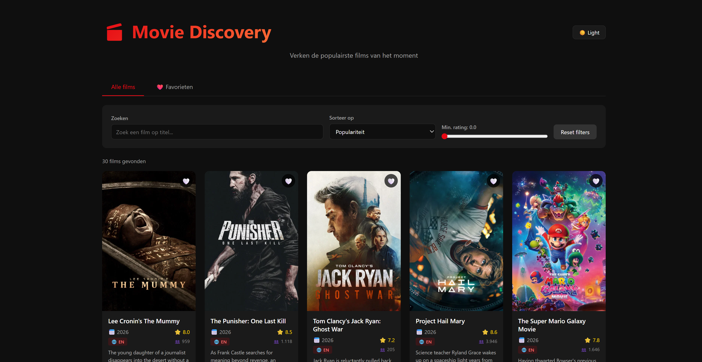
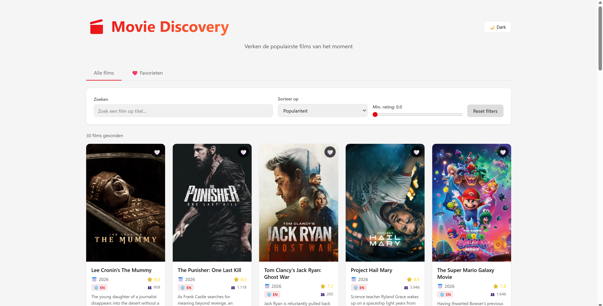
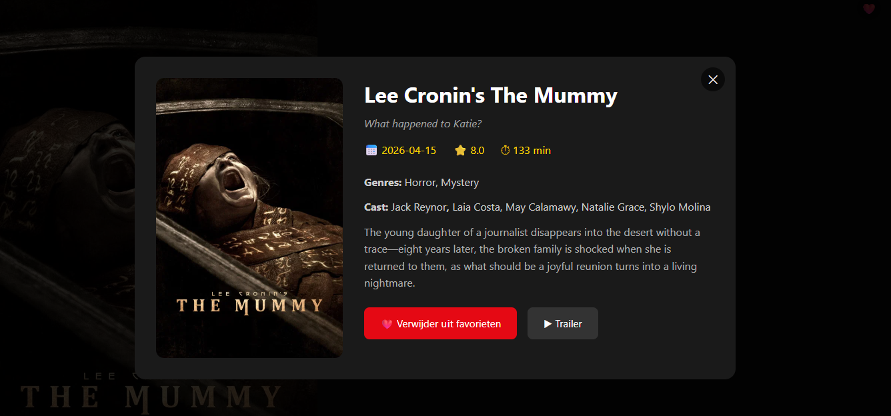
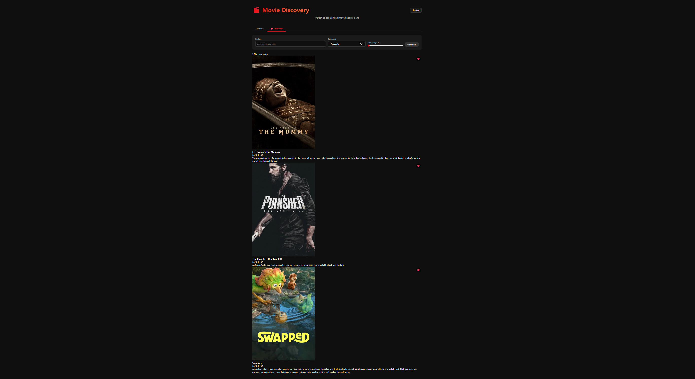
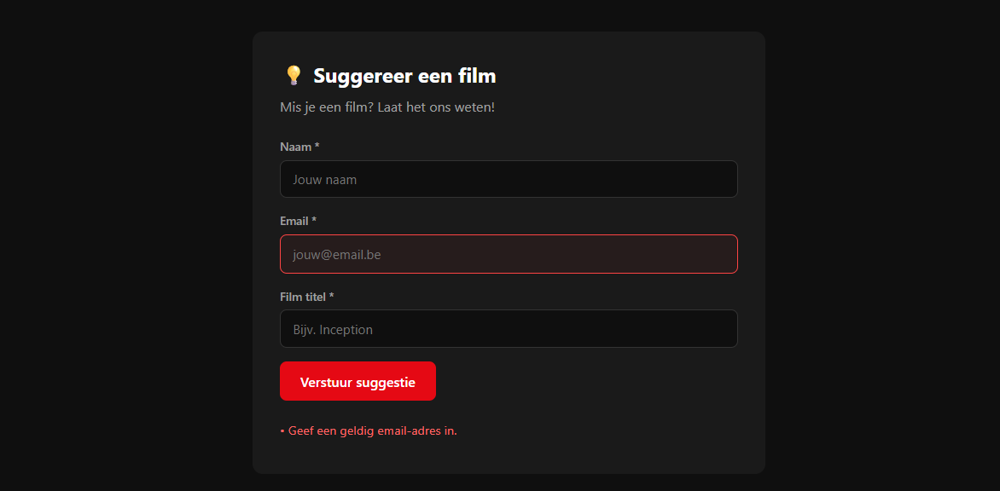

# 🎬 Movie Discovery

Een interactieve Single Page Application gebouwd voor het vak **Web Advanced**. Deze applicatie laat gebruikers de populairste films verkennen via de TMDB API, met filteren, zoeken, sorteren en het opslaan van favorieten.

🔗 **Live demo:** https://movie-discovery-sepia.vercel.app/
📂 **GitHub:** https://github.com/artingx/movie-discovery

---

## 📑 Inhoud

- [Functionaliteiten](#-functionaliteiten)
- [API](#-api)
- [Installatie](#-installatie)
- [Folderstructuur](#-folderstructuur)
- [Technische vereisten](#-technische-vereisten)
- [Screenshots](#-screenshots)
- [Bronnen](#-bronnen)
- [AI-log](#-ai-log)

---

## ✨ Functionaliteiten

### Dataverzameling & -weergave
- 30 films opgehaald via de TMDB API (verdeeld over 2 paginas)
- Grid-weergave met poster, titel, jaar, rating, beschrijving en favoriet-knop (6 elementen per kaart)
- Detail-modal met genres, runtime, cast, tagline en trailer-link

### Interactiviteit
- 🔍 **Zoekfunctie** op filmtitel (live tijdens typen)
- 📊 **Sorteren** op populariteit, titel (A-Z), rating of releasedatum
- ⭐ **Filter** op minimum rating (slider 0-10)
- 🔄 **Reset filters** in één klik

### Personalisatie
- ❤️ **Favorieten** opslaan en verwijderen (bewaard in LocalStorage tussen sessies)
- 🌓 **Theme switcher** (dark/light mode, voorkeur bewaard)
- 📑 Aparte tab voor alleen favoriete films

### Gebruikerservaring
- Responsive design (mobiel, tablet, desktop)
- Fade-in animaties via Observer API
- Modal sluit via ESC-toets of klik buiten content
- Live form validation met visuele feedback

---

## 🌐 API

- **The Movie Database (TMDB)**: https://www.themoviedb.org/
- **Endpoint:** `https://api.themoviedb.org/3/movie/popular` (lijst)
- **Endpoint:** `https://api.themoviedb.org/3/movie/{id}` (details + cast + videos)
- **Documentation:** https://developer.themoviedb.org/docs

---

## 📦 Installatie

### Vereisten
- [Node.js](https://nodejs.org/) (v18 of hoger)
- [npm](https://www.npmjs.com/)
- Gratis TMDB API-key: https://www.themoviedb.org/signup

### Stappen

1. **Clone de repository**
```bash
   git clone https://github.com/artingx/movie-discovery.git
   cd movie-discovery
```

2. **Installeer dependencies**
```bash
   npm install
```

3. **Maak een `.env` bestand** in de root van het project:    

VITE_TMDB_API_KEY=jouw_tmdb_api_key_hier


4. **Start de dev server**
```bash
   npm run dev
```

5. **Open** [http://localhost:5173](http://localhost:5173) in je browser.

---

## 📁 Folderstructuur

movie-discovery/
├── docs/
│   ├── screenshots/        # Screenshots van de applicatie
│   └── ai-log/             # AI-chatlog
├── public/                 # Statische bestanden
├── src/
│   ├── main.js             # Hoofdlogica (alle JavaScript)
│   └── style.css           # Alle styling
├── .env                    # API-key (niet in git)
├── .gitignore
├── index.html              # Entry-point
├── package.json
├── README.md
└── vite.config.js

---

## ✅ Technische vereisten

Hieronder een overzicht van waar elk vereiste concept in de code terug te vinden is.

### DOM manipulatie
| Concept | Bestand | Regels |
|---|---|---|
| Elementen selecteren (`querySelector`) | `src/main.js` | overal — bv. regel 207, 213 |
| Elementen manipuleren (`innerHTML`, `textContent`, `classList`) | `src/main.js` | bv. regel 200, 270, 280 |
| Events aan elementen koppelen (`addEventListener`) | `src/main.js` | functie `setupEventListeners` — regel 285+ |

### Modern JavaScript
| Concept | Voorbeeld | Regel |
|---|---|---|
| Constanten (`const`) | `const API_KEY = ...` | regel 4 |
| Template literals | `` `${API_BASE_URL}/movie/popular?api_key=${API_KEY}...` `` | regel 65 |
| Iteratie (`for`, `forEach`) | `for (let page = 1; ...)` | regel 63 |
| Array methods (`.filter`, `.map`, `.sort`, `.find`, `.some`) | bv. `result.filter(...)` | regel 87 |
| Arrow functions | `const createMovieCard = (movie) => {...}` | regel 110 |
| Ternary operator | `movie.poster_path ? ... : ...` | regel 112 |
| Callback functions | `(event) => { currentFilters.search = ... }` | regel 286 |
| Promises (`.then` impliciet via async) | in `fetchPopularMovies` | regel 56 |
| Async / await | `async function fetchPopularMovies()` | regel 56 |
| Observer API | `IntersectionObserver` in `observeCards` | regel 135 |

### Data & API
| Concept | Locatie |
|---|---|
| Fetch | `fetchPopularMovies()` en `fetchMovieDetails()` |
| JSON parsen | `response.json()` |
| JSON weergeven | `createMovieCard()` rendert objecten naar HTML |

### Opslag & validatie
| Concept | Locatie |
|---|---|
| LocalStorage | `getFavorites()`, `saveFavorites()`, `getTheme()`, `setTheme()` |
| Formulier validatie | `validateSuggestionForm()` met regex voor email + lengte-checks |

### Styling & layout
| Concept | Locatie |
|---|---|
| HTML layout (CSS Grid + Flexbox) | `src/style.css` — `.movies-grid`, `.controls`, `.modal-grid` |
| Responsive | `@media` queries onderaan `src/style.css` |
| Gebruiksvriendelijke elementen | Hartje-knoppen, reset-knop, close-knop, icoontjes |

### Tooling & structuur
- Project opgezet met **Vite**
- Gescheiden `src/` (code), `public/` (assets), `docs/` (documentatie)
- Build: `npm run build` produceert `dist/` folder
- Meerdere commits per onderdeel en per dag (zie GitHub history)

---

## 📸 Screenshots

### Hoofdpagina (dark mode)


### Light mode


### Detail-modal


### Favorieten


### Formulier validatie


---

## 📚 Bronnen

- **TMDB API documentation**: https://developer.themoviedb.org/docs
- **Vite documentation**: https://vitejs.dev/guide/
- **MDN — IntersectionObserver**: https://developer.mozilla.org/en-US/docs/Web/API/Intersection_Observer_API
- **MDN — LocalStorage**: https://developer.mozilla.org/en-US/docs/Web/API/Window/localStorage
- **MDN — Fetch API**: https://developer.mozilla.org/en-US/docs/Web/API/Fetch_API
- **CSS Grid Layout**: https://css-tricks.com/snippets/css/complete-guide-grid/

---

## 🤖 AI-log

Voor de ontwikkeling van dit project werd **Claude (Anthropic)** ingezet als hulpmiddel voor planning, uitleg van concepten, en het debuggen van code. De volledige chatlog is terug te vinden in `docs/ai-log/claude-conversation.md`.

Belangrijke punten:
- Alle code werd zelf nagelezen en aangepast waar nodig
- AI werd gebruikt als sparring-partner, niet als kant-en-klare oplossing
- Conceptuele uitleg werd gevraagd voor o.a. Observer API en LocalStorage-patronen

---

## 👤 Auteur

**Artin** — student Web Advanced @ Erasmushogeschool Brussel
GitHub: [@artingx](https://github.com/artingx)
